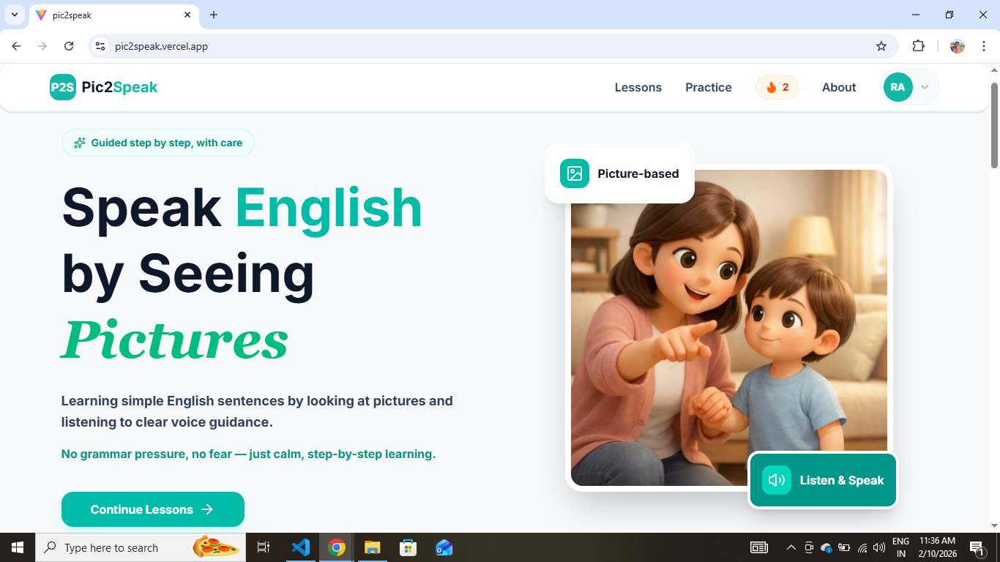
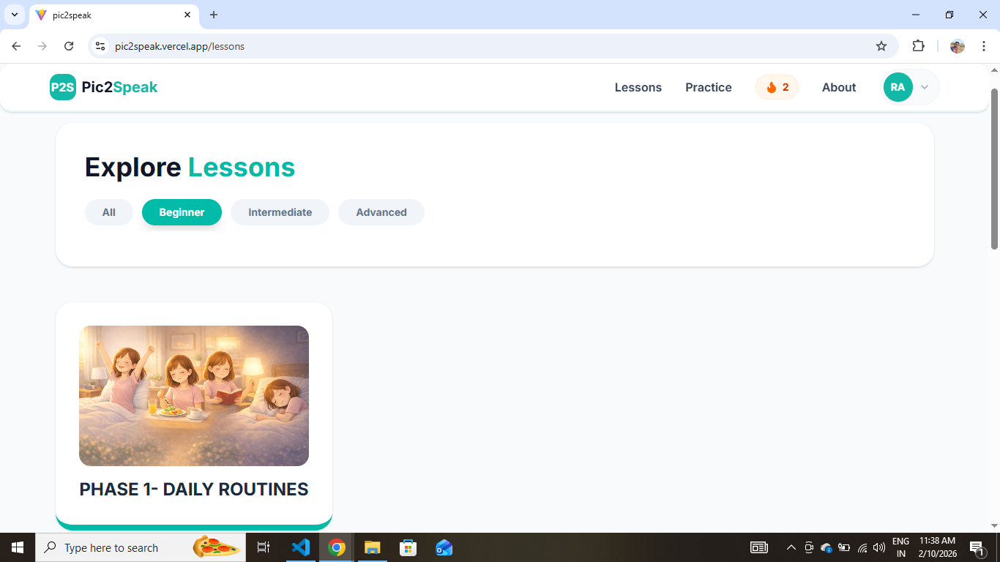
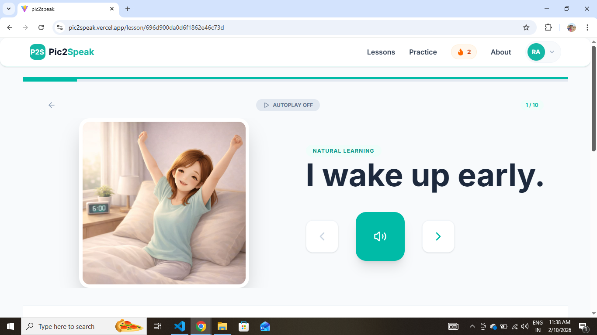

# Pic2Speak (P2S) Frontend 🚀

The interactive user interface for the **Pic2Speak** language learning platform. Built with React and Tailwind CSS, this frontend focuses on providing a seamless, distraction-free learning experience with real-time audio-visual synchronization.

> 💡 **Project Series:** This project is part of my **"Building a Full-Stack App from Scratch"** series.

## 🔗 Live Demo
[🚀 View Live App](https://pic2speak.vercel.app/)

---

## 🖼️ App Gallery

### 🏠 Home Page

*A welcoming, clean landing page designed with a warm-cream aesthetic to reduce eye strain.*

### 📚 Lesson Dashboard

*Dynamic filtering system allowing users to navigate through levels, categories, and topics.*

### 🎮 Lesson Player (Core Feature)

*The heart of the app: featuring synchronized audio playback, image rendering, and progress tracking.*

---

## 🛠 Tech Stack
- **Framework:** React.js (Vite)
- **Routing:** React Router DOM v6
- **Styling:** Tailwind CSS (Custom Theme: Warm Cream)
- **State Management:** Context API / Redux
- **Icons:** Lucide React
- **Deployment:** Vercel

---

## 🧠 Frontend Core Concepts

### 🔒 Secure Route Management
As seen in `App.jsx`, I have implemented a robust routing system:
- **Protected Routes:** Uses a `<ProtectedRoute />` wrapper to ensure that learning content (Lessons, Practice, Player) is only accessible to authenticated users.
- **Nested Dynamic Routing:** Implemented deep-linking using path parameters to handle complex content hierarchies: `/lessons/:level/:categoryId/:topicId`.

### 🎮 Interactive Lesson Player Logic
- **Media Sync:** Developed logic within `LessonPlayer.jsx` to synchronize image display with high-quality audio voice-overs.
- **Atomic Progress Tracking:** Upon completing a lesson, the frontend triggers an API call to the backend to update the user's streak and practice history in real-time.

---

## 📁 Project Structure

```text
frontend/
├── public/             # Static assets (Vite logo, etc.)
├── screenshots/        # App UI Gallery for README
│    ├── home.png
│    ├── lesson.png
│    └── lessonplayer.png
├── src/
│    ├── api/           # Axios/Fetch utility functions for backend calls
│    ├── assets/        # CSS and UI-specific small media files
│    ├── components/    # Reusable UI (Navbar, Footer, ProtectedRoute)
│    ├── home/          # HomePage components
│    ├── pages/         # Main Views (Lessons, LessonPlayer, PracticePage)
│    ├── redux/         # Centralized State Management (Auth & Progress)
│    ├── App.jsx        # Routing & Application Entry Point
│    └── main.jsx       # React DOM Initialization
├── .env.example        # Template for environment variables
├── tailwind.config.js  # Custom theme and styling configuration
└── README.md